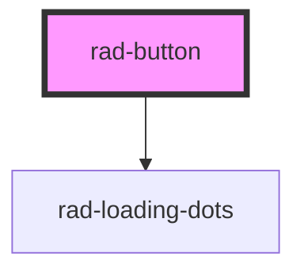

# rad-button

<!-- Auto Generated Below -->

## Properties

| Property    | Attribute    | Description | Type                                                     | Default     |
| ----------- | ------------ | ----------- | -------------------------------------------------------- | ----------- |
| `color`     | `color`      |             | `"primary" \| "secondary" \| "success" \| "transparent"` | `undefined` |
| `disabled`  | `disabled`   |             | `boolean`                                                | `undefined` |
| `fullWidth` | `full-width` |             | `boolean`                                                | `undefined` |
| `loading`   | `loading`    |             | `boolean`                                                | `undefined` |
| `shadow`    | `shadow`     |             | `boolean`                                                | `undefined` |
| `size`      | `size`       |             | `"medium" \| "small"`                                    | `undefined` |
| `type`      | `type`       |             | `string`                                                 | `"button"`  |
| `width`     | `width`      |             | `number`                                                 | `undefined` |

## Dependencies

### Depends on

- [rad-loading-dots](../rad-loading-dots)

### Graph

----------------------------------------------

*Built with [StencilJS](https://stenciljs.com/)*
